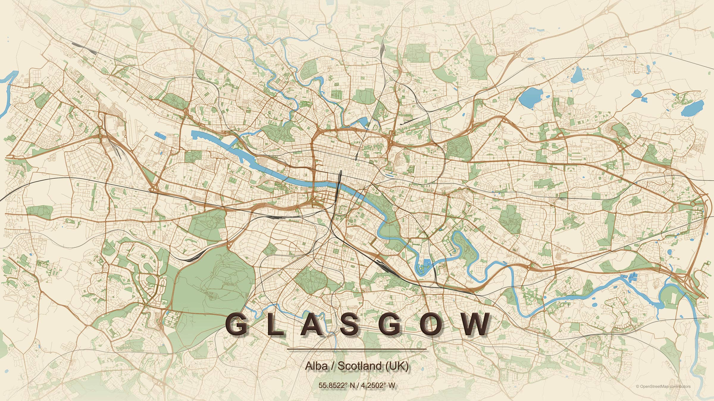
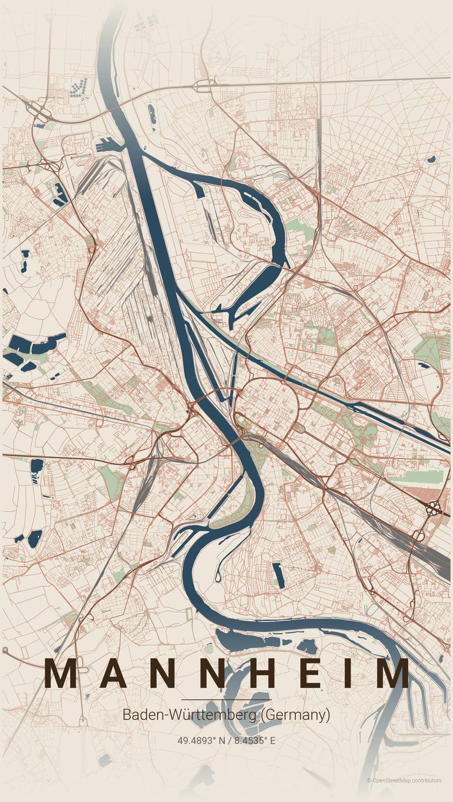
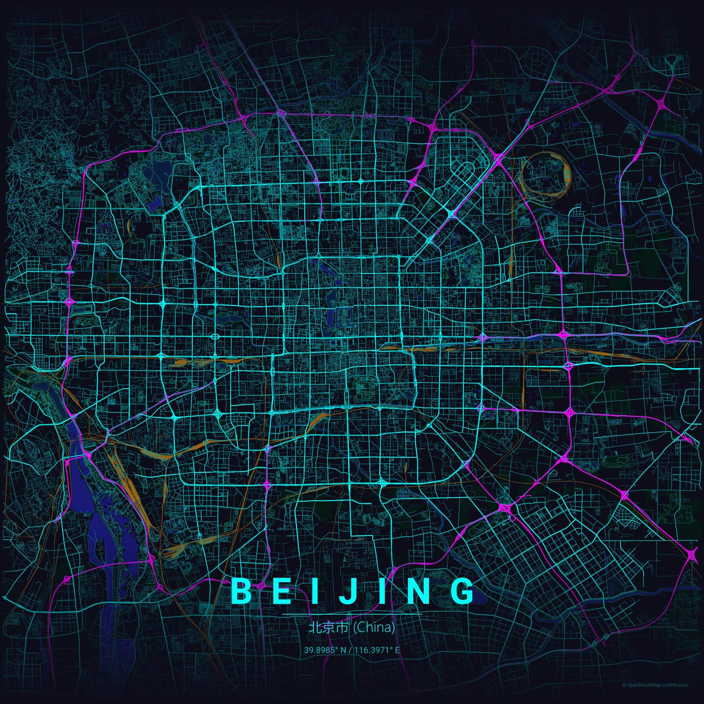

# City Map Poster Generator

Another python repository which allows you to create stylish maps from OSM data which can by customised by using different themes.

| Glasgow parchment - generated as svg_layered and post processing in Affinity/Inkscape
| :---: |



| Mannheim Matrix | Mannheim vintage | Beijing neon_cyber_rail| 
| :---: | :---: | :---: |
|  |  |  |  

| layered SVG output makes it easy to animate the different layers directly in SVG |
| :---: |
| |

This is a modular version of the [maptoposter](https://github.com/originalankur/maptoposter)    with the following changes:
- The original script (at the time of my fork mid January 2026) was broken down into modules
- Data processing and rendering has been separated so the "--theme all" does data processing once and then only rendering for the different themes
- You can either use city/country with or without shifting the map centre or using lat/long coordinates as well as shifting
- Font handling of was improved, the output ratio can be given and the labeling has been changed to work with all kind of ratios.
- Cache handling has been changed so it is on a per city bases - once you are done with a city you can remove all the cached files easily.
- Railway lines are included and the state/province was added to the description
- You can export as layered svg which opens up post-processing possibilities.  
Layers are named according to the OSM layers : parks, water, roads (residential → tertiary → secondary → primary → motorway))

## Usage


```shell
General usage:
  python create_map_poster.py --city <city> --country <country> [options]

Examples:
  # Basic usage (automatic geocoding)
  python create_map_poster.py -c "New York" -C "USA" -t noir -d 12000
  python create_map_poster.py -c "Barcelona" -C "Spain" -t warm_beige -d 8000
  
  # Generate ALL themes at once (data processed only once!)
  python create_map_poster.py -c "Tokyo" -C "Japan" -d 15000 --theme all
  python create_map_poster.py -c "Paris" -C "France" -d 10000 --theme all --ratio 16:9
  
  # Generate layered SVG for post-processing in Illustrator/Inkscape
  # The output will be saved with a .svg-layered ending to distinguish it from the "normal" svg
  # output - to open the file you will need to change the extension to .svg
  python create_map_poster.py -c "Tokyo" -C "Japan" -d 15000 --format svg-layered
  python create_map_poster.py -c "Paris" -C "France" -d 10000 --format svg-layered -t noir
  
  # Using manual coordinates (bypasses geocoding for coordinates only)
  python create_map_poster.py -c "Beijing" -C "China" --lat 39.916535 --lon 116.397067 -d 20000
  python create_map_poster.py -c "Tokyo" -C "Japan" --lat 35.6762 --lon 139.6503 -t japanese_ink
  
  # Combining manual coordinates with shift
  python create_map_poster.py -c "Paris" -C "France" --lat 48.8566 --lon 2.3522 --shift 2n -d 10000
  
  # Using shift to adjust framing (with automatic geocoding)
  python create_map_poster.py -c "London" -C "UK" -d 15000 --shift 3.5sw
  python create_map_poster.py -c "Beijing" -C "China" -t parchment -d 18000 --ratio 1:1 --shift 32s
  
  # Generate all themes with shift
  python create_map_poster.py -c "Sydney" -C "Australia" -d 12000 --theme all --shift 3ne
  
  # Waterfront & canals
  python create_map_poster.py -c "Venice" -C "Italy" -t blueprint -d 4000
  python create_map_poster.py -c "Amsterdam" -C "Netherlands" -t ocean -d 6000
  
  # List themes
  python create_map_poster.py --list-themes

Options:
  --city, -c        City name (required)
  --country, -C     Country name (required)
  --lat             Latitude (optional, overrides geocoding for coordinates)
  --lon, --long     Longitude (optional, overrides geocoding for coordinates)
  --theme, -t       Theme name or "all" for all themes (default: feature_based)
  --distance, -d    Map radius in meters (default: 29000)
  --shift, -s       Shift map center (e.g., "2w", "5ne", "3.5s", "4nnw")
  --ratio, -r       Aspect ratio (default: 1:1). Examples: 1:1, 4:3, 16:9, 3:4, 9:16
  --format, -f      Output format: png, svg, pdf (default: png)
  --list-themes     List all available themes
  --rebuild-fonts   Rebuild matplotlib font cache (fixes CJK display issues)
          
Note: When using --lat and --lon:
      - Both must be provided together
      - The script will still geocode the city to get state/province info
      - Only the coordinates are overridden, not the location metadata
          
Shift directions (16-point compass):
  Cardinal: n, e, s, w
  Ordinal: ne, se, sw, nw
  Intercardinal: nne, ene, ese, sse, ssw, wsw, wnw, nnw
  Examples: 2w (2km west), 5ne (5km northeast), 4nnw (4km north-northwest)
          
Aspect ratio examples:
  1:1     Square poster (Instagram)
  4:3     Traditional landscape
  3:4     Traditional portrait
  16:9    Widescreen landscape
  9:16    Widescreen portrait
          
Distance guide:
  4000-6000m   Small/dense cities (Venice, Amsterdam old center)
  8000-12000m  Medium cities, focused downtown (Paris, Barcelona)
  15000-20000m Large metros, full city view (Tokyo, Mumbai)

Performance tip: Use "--theme all" to generate all themes at once!
  The expensive data processing (OSM download, graph projection, geometry processing)
  happens only ONCE, then all themes are rendered quickly.

Available themes can be found in the 'themes/' directory. 
If you want to use "--theme all" only on a subset of themes just move the ones you 
do not want into a backup directory. 
Generated posters are saved to 'posters/' directory.
```


## Project Structure

```
map_poster_generator/
├── __init__.py              # Package initialization
├── cache.py                 # Cache management (coordinates, OSM data)
├── fonts.py                 # Font handling with CJK support
├── geocoding.py             # Geocoding and coordinate manipulation
├── themes.py                # Theme loading and management
├── osm_data.py              # OSM data fetching
├── data_processing.py       # Data processing pipeline
├── rendering.py             # Poster rendering engine (PNG/PDF)
├── svg_renderer.py          # SVG layered rendering engine
└── utils.py                 # Utility functions

create_map_poster.py         # Main CLI script

themes/                      # Theme JSON files
fonts/                       # Custom Roboto fonts
posters/                     # Generated posters (output)
cache/                       # Cached OSM data
```

## Module Breakdown

### `cache.py` - Cache Management
**Purpose**: Handles all caching operations to avoid re-downloading data.

**Key Functions**:
- `set_cache_city(city, country)` - Set up city-specific cache directory
- `cache_get(name)` - Retrieve cached data
- `cache_set(name, obj)` - Store data in cache
- `configure_osmnx_cache(cache_dir)` - Configure OSMnx to use our cache

**Why separate**: Caching is a cross-cutting concern used by multiple modules. Separating it makes it easy to swap out the caching strategy (e.g., Redis, database) without touching other code.

### `fonts.py` - Font Management
**Purpose**: Manages fonts with automatic CJK (Chinese/Japanese/Korean) support.

**Key Functions**:
- `load_fonts()` - Load custom Roboto fonts
- `has_cjk_characters(text)` - Detect if text needs CJK fonts
- `get_font_with_fallback(...)` - Get appropriate font for text
- `rebuild_font_cache()` - Rebuild matplotlib font cache

**Why separate**: Font handling, especially with CJK detection, is complex enough to warrant its own module. Makes it easy to add support for more languages.

### `geocoding.py` - Geocoding & Coordinates
**Purpose**: All geocoding operations and coordinate manipulation.

**Key Functions**:
- `get_coordinates(city, country)` - Fetch coordinates and state/province
- `get_state_province(city, country)` - Get just state/province info
- `apply_shift(lat, lon, shift_str)` - Shift coordinates by distance/direction

**Why separate**: Geocoding has clear boundaries and dependencies (geopy). Separating makes it easy to swap geocoding providers or add offline geocoding.

### `themes.py` - Theme Management
**Purpose**: Load and manage color themes from JSON files.

**Key Functions**:
- `get_available_themes()` - List all available themes
- `load_theme(theme_name)` - Load a specific theme
- `list_themes_info()` - Print detailed theme information

**Why separate**: Theme management is self-contained with no complex dependencies. Makes it easy to add theme validation, theme creation tools, etc.

### `osm_data.py` - OSM Data Fetching
**Purpose**: Fetch data from OpenStreetMap via OSMnx.

**Key Functions**:
- `fetch_graph(point, dist)` - Fetch street network
- `fetch_features(point, dist, tags, name)` - Fetch geographic features
- `project_and_filter_features(...)` - Project and filter geometries

**Why separate**: OSM interactions are distinct from the rest of the app. Makes it easy to add retry logic, error handling, or switch to a different data source.

### `data_processing.py` - Data Processing Pipeline
**Purpose**: The heavy lifting - process OSM data into render-ready format.

**Key Functions**:
- `fetch_and_process_map_data(...)` - Main processing pipeline
- `get_crop_limits(G, fig)` - Calculate aspect-ratio-correct crop limits

**Why separate**: This is the most expensive operation. Separating it makes the "process once, render many" pattern clear and enables future optimizations like parallel processing.

### `rendering.py` - Rendering Engine
**Purpose**: Generate the actual poster images from processed data.

**Key Functions**:
- `render_poster_from_processed_data(...)` - Main rendering function
- `get_edge_colors_by_type(G, theme)` - Assign road colors
- `get_edge_widths_by_type(G)` - Assign road widths
- `draw_bottom_label(...)` - Draw city name and metadata
- `create_gradient_fade(...)` - Add gradient effects

**Why separate**: Rendering is logically distinct from data processing. Separating makes it easy to add new rendering styles, export formats, or visual effects.

### `svg_renderer.py` - SVG Layered Rendering
**Purpose**: Generate editable, layered SVG files for post-processing.

**Key Functions**:
- `render_svg_poster_from_processed_data(...)` - Create layered SVG
- `add_polygon_layer(...)` - Add water/park layers
- `add_linestring_layer(...)` - Add road/railway layers
- `add_roads_by_type(...)` - Separate roads by classification
- `add_text_layer(...)` - Add labels and metadata

**Why separate**: SVG output has completely different requirements than raster (PNG/PDF). Separate module allows specialized layer handling, proper ID/class naming, and coordinate transformation specific to SVG format. Enables powerful post-processing in Illustrator/Inkscape.

**See**: `SVG_RENDERER_GUIDE.md` for detailed usage instructions.

### `utils.py` - Utilities
**Purpose**: Helper functions used across modules.

**Key Functions**:
- `generate_output_filename(...)` - Create unique output filenames
- `parse_aspect_ratio(ratio_str)` - Parse aspect ratio strings

**Why separate**: Prevents circular dependencies and provides a home for functions that don't fit elsewhere.

### `create_map_poster.py` - Main CLI Script
**Purpose**: Command-line interface that orchestrates all modules.

**Why separate**: Keeps the CLI concerns separate from the business logic. Makes it easy to create alternative interfaces (GUI, web API, etc.) using the same modules.

